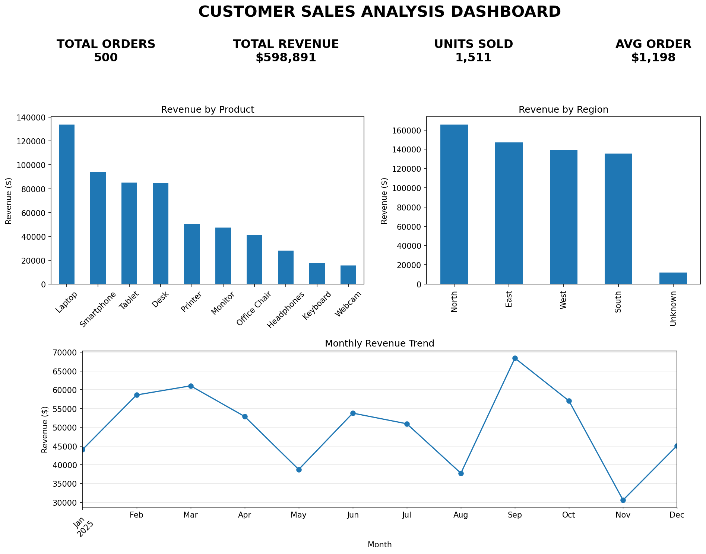
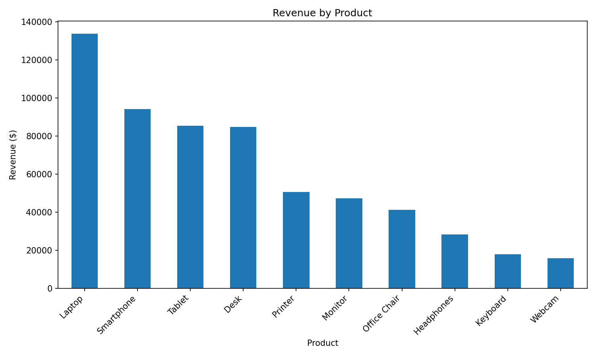
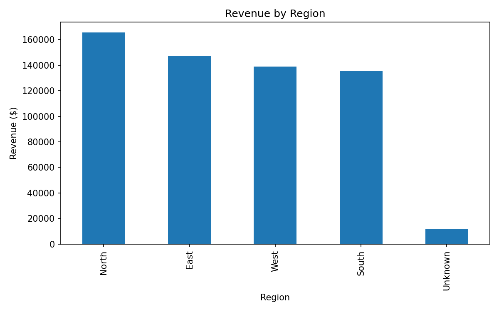
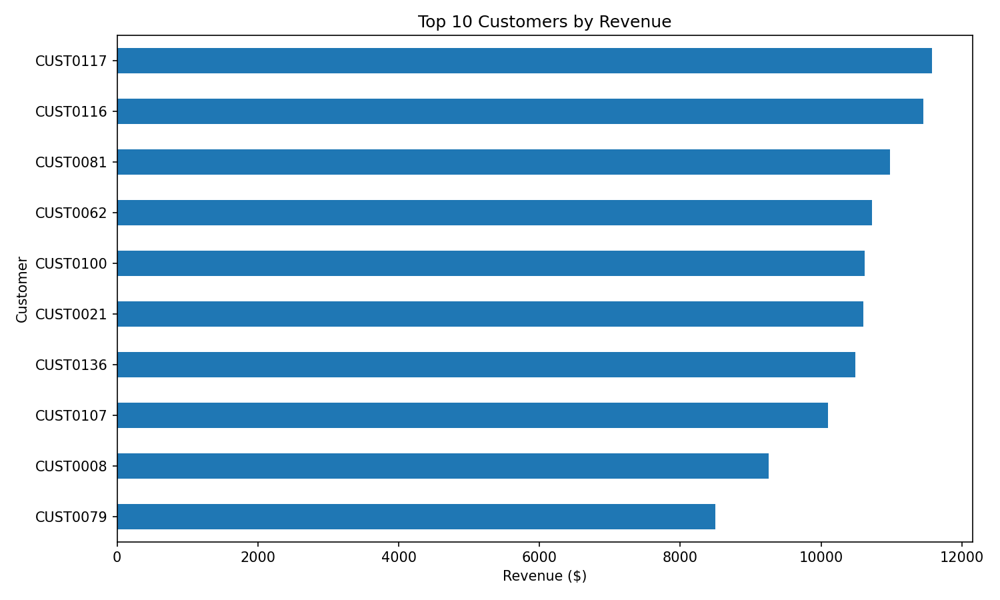
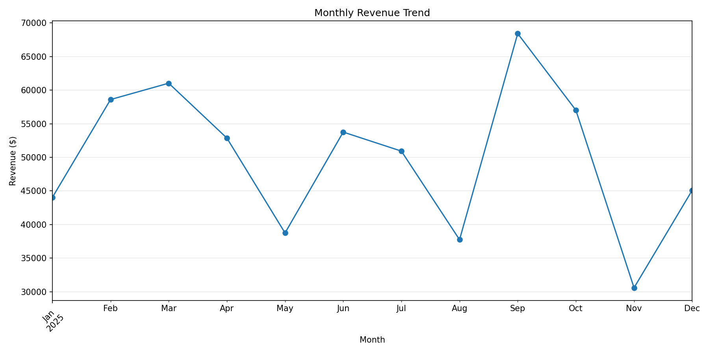

# Customer Sales Analysis

## 📊 Présentation du projet

**Customer Sales Analysis** est un projet d'analyse de données commerciales réalisé avec **Python**.

L'objectif est d'explorer un jeu de données de ventes afin d'identifier les principales tendances commerciales, de calculer des indicateurs de performance (KPI) et de produire des visualisations permettant de faciliter l'interprétation des résultats.

L'analyse repose principalement sur les bibliothèques **Pandas**, **NumPy** et **Matplotlib**.

---

## 🎯 Objectifs

Ce projet a pour objectifs de :

- Explorer et comprendre les données de ventes
- Nettoyer et préparer les données
- Identifier les éventuelles valeurs manquantes ou anomalies
- Calculer les principaux indicateurs de performance (KPI)
- Analyser les ventes et le chiffre d'affaires
- Identifier les tendances commerciales
- Analyser les performances par produit
- Analyser les performances par région
- Analyser les performances par client
- Étudier l'évolution mensuelle du chiffre d'affaires
- Créer des visualisations permettant de mieux interpréter les résultats
- Produire des insights utiles pour l'analyse commerciale

---

## 🛠️ Technologies utilisées

- **Python**
- **Pandas**
- **NumPy**
- **Matplotlib**
- **Jupyter Notebook / VS Code**

---

## 📂 Données

Le projet utilise un fichier CSV contenant les données de ventes :

```text
raw_sales.csv
```

Les données brutes sont ensuite nettoyées et préparées pour l'analyse.

Le fichier nettoyé est disponible sous :

```text
clean_sales.csv
```

### Fichiers de données

| Fichier | Description |
|---|---|
| `raw_sales.csv` | Données de ventes brutes |
| `clean_sales.csv` | Données nettoyées et préparées |

---

## 🧹 Préparation des données

Une étape de préparation des données est réalisée avant l'analyse afin de disposer d'un jeu de données exploitable.

Cette étape permet notamment de :

- Vérifier la qualité des données
- Identifier les éventuelles valeurs manquantes
- Détecter les éventuelles anomalies
- Nettoyer les données
- Préparer les données pour les différentes analyses

Le résultat de cette préparation est enregistré dans :

```text
clean_sales.csv
```

---

## 📈 Analyses réalisées

### 💰 Analyse des ventes

L'analyse permet d'étudier plusieurs indicateurs commerciaux, notamment :

- Le chiffre d'affaires total
- Le nombre total de commandes
- Le nombre de clients
- Le nombre d'unités vendues
- Le panier moyen
- Le chiffre d'affaires par produit
- Le chiffre d'affaires par région
- Le chiffre d'affaires par client
- L'évolution mensuelle du chiffre d'affaires

### 📦 Analyse par produit

L'analyse permet de comparer le chiffre d'affaires généré par les différents produits et d'identifier les produits les plus performants.

### 🌍 Analyse par région

Les performances commerciales sont comparées entre les différentes régions afin d'identifier les zones générant le plus de chiffre d'affaires.

### 👥 Analyse par client

L'analyse du chiffre d'affaires par client permet d'identifier les clients contribuant le plus aux ventes.

### 📅 Analyse temporelle

L'évolution mensuelle du chiffre d'affaires permet d'identifier les périodes les plus performantes et d'observer les tendances commerciales au cours du temps.

---

## 📊 Visualisations

Le projet comprend plusieurs visualisations permettant d'analyser les performances commerciales sous différents angles.

### 🎯 Sales Dashboard

Le dashboard présente une vue synthétique des principaux indicateurs :

- Nombre total de commandes
- Chiffre d'affaires total
- Nombre d'unités vendues
- Panier moyen
- Chiffre d'affaires par produit
- Chiffre d'affaires par région
- Évolution mensuelle du chiffre d'affaires



### 📦 Chiffre d'affaires par produit

Cette visualisation permet de comparer les performances des différents produits.



### 🌍 Chiffre d'affaires par région

Cette analyse permet d'identifier les régions générant le plus de chiffre d'affaires.



### 👥 Top 10 clients

Cette visualisation présente les 10 clients générant le plus de chiffre d'affaires.



### 📅 Évolution mensuelle du chiffre d'affaires

Cette visualisation permet d'observer l'évolution du chiffre d'affaires mois par mois sur la période analysée.



---

## 🔎 Principaux résultats

L'analyse permet d'identifier les principaux indicateurs de performance suivants :

| Indicateur | Résultat |
|---|---:|
| 💰 Chiffre d'affaires total | **$598,891.00** |
| 🛒 Nombre total de commandes | **500** |
| 👥 Nombre de clients | **143** |
| 📦 Unités vendues | **1,511** |
| 🧾 Panier moyen | **$1,198** |
| 🏆 Produit avec le CA le plus élevé | **Laptop — $133,689.58** |
| 🏷️ Catégorie avec le CA le plus élevé | **Electronics — $362,114.55** |
| 🌍 Région avec le CA le plus élevé | **North — $165,446.41** |
| 📅 Meilleur mois | **September 2025 — $68,426.37** |

---

## 💡 Insights commerciaux

Les résultats mettent notamment en évidence :

- Le chiffre d'affaires total atteint **$598,891.00** pour **500 commandes**.
- **1,511 unités** ont été vendues sur la période analysée.
- Le panier moyen est d'environ **$1,198 par commande**.
- **Laptop** est le produit générant le chiffre d'affaires le plus élevé avec **$133,689.58**.
- **Electronics** est la catégorie générant le chiffre d'affaires le plus élevé avec **$362,114.55**.
- **North** est la région la plus performante avec **$165,446.41** de chiffre d'affaires.
- **September 2025** représente le meilleur mois avec **$68,426.37** de chiffre d'affaires.
- L'évolution mensuelle montre des variations importantes du chiffre d'affaires, avec un pic en septembre et un niveau particulièrement faible en novembre.

---

## 🗂️ Structure du projet

```text
customer-sales-analysis/
│
├── customer_sales_analysis.py
│
├── raw_sales.csv
├── clean_sales.csv
│
├── monthly_sales.png
├── sales_by_customer.png
├── sales_by_product.png
├── sales_by_region.png
├── sales_dashboard.png
│
└── README.md
```

### Description des fichiers

| Fichier | Description |
|---|---|
| `customer_sales_analysis.py` | Script principal d'analyse |
| `raw_sales.csv` | Données de ventes brutes |
| `clean_sales.csv` | Données nettoyées |
| `monthly_sales.png` | Évolution mensuelle des ventes |
| `sales_by_customer.png` | Analyse des ventes par client |
| `sales_by_product.png` | Analyse des ventes par produit |
| `sales_by_region.png` | Analyse des ventes par région |
| `sales_dashboard.png` | Dashboard synthétique |
| `README.md` | Documentation du projet |

---

## ▶️ Exécution du projet

### 1. Cloner le repository

```bash
git clone https://github.com/JihadKeraoui/customer-sales-analysis.git
cd customer-sales-analysis
```

### 2. Installer les dépendances

```bash
pip install -r requirements.txt
```

### 3. Exécuter le script

```bash
python customer_sales_analysis.py
```

Le script réalise les traitements nécessaires à l'analyse et permet de produire les résultats et visualisations du projet.

---

## 📦 Dépendances

Les principales bibliothèques utilisées sont :

```text
pandas
numpy
matplotlib
```

Les dépendances complètes sont disponibles dans :

```text
requirements.txt
```

---

## 📌 Résumé

**Customer Sales Analysis** met en pratique plusieurs étapes essentielles d'un processus de Data Analysis :

```text
Données brutes
      ↓
Nettoyage des données
      ↓
Préparation
      ↓
Analyse avec Pandas / NumPy
      ↓
Calcul des KPI
      ↓
Visualisation avec Matplotlib
      ↓
Identification des tendances
      ↓
Insights commerciaux
```

Ce projet constitue une mise en pratique de l'analyse de données avec **Python, Pandas, NumPy et Matplotlib**, depuis la préparation des données jusqu'à l'interprétation des résultats.
